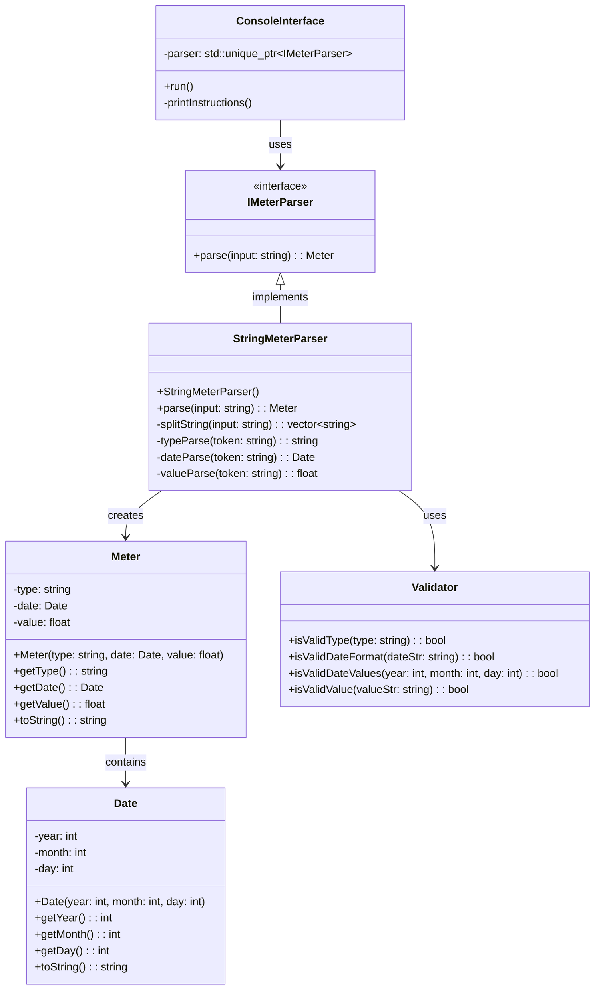

### Диаграмма Классов (UML)

```mermaid
classDiagram
    class ConsoleInterface {
        +run()
        -printInstructions()
        -parser: std::unique_ptr~IMeterParser~
    }

    class Meter {
        +Meter(type: string, date: Date, value: float)
        +getType(): string
        +getDate(): Date
        +getValue(): float
        +toString(): string
        -type: string
        -date: Date
        -value: float
    }

    class Date {
        +Date(year: int, month: int, day: int)
        +getYear(): int
        +getMonth(): int
        +getDay(): int
        +toString(): string
        -year: int
        -month: int
        -day: int
    }

    class IMeterParser {
        <<interface>>
        +parse(input: string): Meter
    }

    class StringMeterParser {
        +StringMeterParser()
        +parse(input: string): Meter
        -splitString(input: string): vector~string~
        -typeParse(token: string): string
        -dateParse(token: string): Date
        -valueParse(token: string): float
    }

    class Validator {
        +isValidType(type: string): bool
        +isValidDateFormat(dateStr: string): bool
        +isValidDateValues(year: int, month: int, day: int): bool
        +isValidValue(valueStr: string): bool
    }

    ConsoleInterface --> IMeterParser : uses
    IMeterParser <|-- StringMeterParser : implements
    StringMeterParser --> Meter : creates
    StringMeterParser --> Validator : uses
    Meter --> Date : contains
```