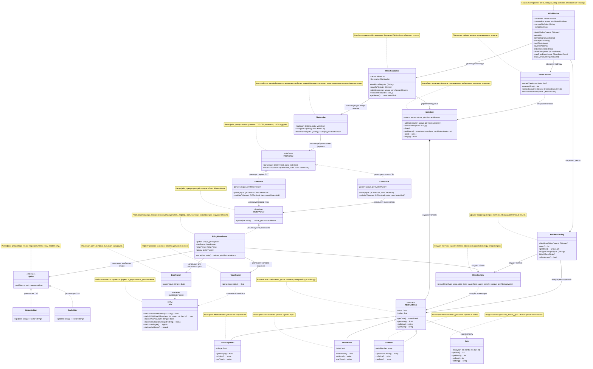

Дулисов С. Р.

```mermaid
classDiagram

    %% =============== Классы для чтения и записи файлов ===============
    class FileHandler {
        +load(path: QString, data: MeterList)
        +save(path: QString, data: MeterList)
        -detectFormat(path: QString): unique_ptr~IFileFormat~
    }
    note for FileHandler "Класс-обёртка над файловыми операциями: выбирает нужный формат, открывает поток, делегирует парсинг/сериализацию."

    class IFileFormat {
        <<interface>>
        +parse(input: QIODevice&, data: MeterList)
        +serializeTo(output: QIODevice&, data: const MeterList&)
    }
    note for IFileFormat "Интерфейс для форматов хранения: TXT, CSV, возможно, JSON и другие."

    class TxtFormat {
        +parse(input: QIODevice&, data: MeterList)
        +serializeTo(output: QIODevice&, data: const MeterList&)
        -parser: unique_ptr~IMeterParser~
    }

    class CsvFormat {
        +parse(input: QIODevice&, data: MeterList)
        +serializeTo(output: QIODevice&, data: const MeterList&)
        -parser: unique_ptr~IMeterParser~
    }

    IFileFormat <|.. TxtFormat : реализует формат TXT
    IFileFormat <|.. CsvFormat : реализует формат CSV

    FileHandler --> IFileFormat : использует реализацию формата


    %% =============== Парсеры ===============
    class IMeterParser {
        <<interface>>
        +parse(line: string): unique_ptr~AbstractMeter~
    }
    note for IMeterParser "Интерфейс, превращающий строку в объект AbstractMeter."

    class StringMeterParser {
        +parse(line: string): unique_ptr~AbstractMeter~
        -splitter: unique_ptr~ISpliter~
        -dateParser: DateParser
        -valueParser: ValueParser
        -factory: MeterFactory
    }
    IMeterParser <|.. StringMeterParser : реализация по умолчанию

    note for StringMeterParser "Реализация парсера строки: использует разделитель, парсеры даты/значения и фабрику для создания объекта."

    TxtFormat --> IMeterParser : использует парсер строк
    CsvFormat --> IMeterParser : использует парсер строк
    StringMeterParser --> ISpliter : делегирует разбиение строки
    StringMeterParser --> DateParser : использует для извлечения даты
    StringMeterParser --> ValueParser : извлекает числовое значение
    StringMeterParser --> MeterFactory : создаёт объект


    %% =============== Разделители строк ===============
    class ISpliter {
        <<interface>>
        +split(line: string): vector~string~
    }
    note for ISpliter "Интерфейс для разбора строки по разделителям (CSV, пробел и т.д.)"

    class StringSplitter {
        +split(line: string): vector~string~
    }

    class CsvSplitter {
        +split(line: string): vector~string~
    }

    ISpliter <|.. StringSplitter : реализация TXT
    ISpliter <|.. CsvSplitter : реализация CSV


    %% =============== Парсеры значений и валидация ===============
    class DateParser {
        +parse(input: string): Date
    }
    note for DateParser "Извлекает дату из строки, вызывает валидацию."

    class ValueParser {
        +parse(input: string): float
    }
    note for ValueParser "Парсит числовое значение, может кидать исключения."

    class Utils {
        <<utility>>
        +static isValidDateFormat(str: string): bool
        +static isValidDateValues(year: int, month: int, day: int): bool
        +static isValidValue(str: string): bool
        +static normalizationString(str: string): string
        +static dateRegex(): regex&
        +static valueRegex(): regex&
    }
    note for Utils "Набор статических проверок: формат и допустимость даты/значения."

    DateParser ..> Utils : вызывает isValidDateFormat
    ValueParser ..> Utils : вызывает isValidValue


    %% =============== Модель данных ===============
    class AbstractMeter {
        <<abstract>>
        +getDate(): const Date&
        +getValue(): float
        +toString(): string
        +getType(): string
        #date: Date
        #value: float
    }
    note for AbstractMeter "Базовый класс счётчиков: дата + значение, интерфейс для toString()."

    class ElectricityMeter {
        +getVoltage(): float
        +toString(): string
        +getType(): string
        -voltage: float
    }
    note for ElectricityMeter "Расширяет AbstractMeter: добавляет напряжение."

    class WaterMeter {
        +isHotWater(): bool
        +toString(): string
        +getType(): string
        -isHot: bool
    }
    note for WaterMeter "Расширяет AbstractMeter: признак горячей воды."

    class GasMeter {
        +getSerialNumber(): string
        +toString(): string
        +getType(): string
        -serialNumber: string
    }
    note for GasMeter "Расширяет AbstractMeter: добавляет серийный номер."

    class Date {
        +Date(year: int, month: int, day: int)
        +getYear(): int
        +getMonth(): int
        +getDay(): int
        +toString(): string
    }
    note for Date "Представление даты: Год, месяц, день. Используется повсеместно."

    class MeterList {
        +addMeter(meter: unique_ptr~AbstractMeter~)
        +removeMeter(index: size_t)
        +clear()
        +getMeters(): const vector~unique_ptr~AbstractMeter~~&
        +size(): size_t
        +empty(): bool
        -meters: vector~unique_ptr~AbstractMeter~~
    }
    note for MeterList "Контейнер для всех счётчиков, поддерживает добавление, удаление, итерацию."

    class MeterFactory {
        +createMeter(type: string, date: Date, value: float, param: string): unique_ptr~AbstractMeter~
    }
    note for MeterFactory "Создаёт счётчики нужного типа по строковому идентификатору и параметрам."

    AbstractMeter <|-- ElectricityMeter
    AbstractMeter <|-- WaterMeter
    AbstractMeter <|-- GasMeter
    AbstractMeter --> Date : содержит дату
    MeterList *-- AbstractMeter : содержит список
    MeterFactory --> AbstractMeter : создаёт экземпляры


    %% =============== UI и логика ===============
    class MeterController {
        +loadFromFile(path: QString)
        +saveToFile(path: QString)
        +addMeter(meter: unique_ptr~AbstractMeter~)
        +removeMeter(index: size_t)
        +getMeters(): const MeterList&
        -meters: MeterList
        -fileHandler: FileHandler
    }
    note for MeterController "Слой логики между UI и моделью. Вызывает FileService и обновляет список."

    class MainWindow {
        +MainWindow(parent: QWidget*)
        -setupUi()
        -connectSignalsAndSlots()
        -addObjectActions()
        -loadFileActions()
        -saveFileActions()
        -onDeleteSelectedRow()
        -closeEvent(event: QCloseEvent)
        -dragEnterEvent(event: QDragEnterEvent)
        -dropEvent(event: QDropEvent)
        -- controller: MeterController
        -- meterView: unique_ptr~MeterListView~
        -- currentFilePath: QString
        -- isModified: bool
    }
    note for MainWindow "Главный интерфейс: меню, загрузка, drag-and-drop, отображение таблицы."

    class AddMeterDialog {
        +AddMeterDialog(parent: QWidget*)
        +exec(): int
        +getMeter(): unique_ptr<AbstractMeter>
        -onTypeChanged(type: QString)
        -hideAllExtraFields()
        -validateInput(): bool
    }
    note for AddMeterDialog "Диалог ввода параметров счётчика. Возвращает готовый объект."

    class MeterListView {
        +updateView(const MeterList&)
        +selectedRow(): int
        +contextMenuEvent(event: QContextMenuEvent)
        +mousePressEvent(event: QMouseEvent)
    }
    note for MeterListView "Обновляет таблицу данных при изменениях модели."


    MeterController --> MeterList : управляет моделью
    MeterController --> FileHandler : использует для ввода/вывода
    MainWindow --> MeterController : делегирует команды
    MainWindow --> AddMeterDialog : открывает диалог
    MainWindow --> MeterListView : обновляет таблицу
    AddMeterDialog --> MeterFactory : создаёт счётчик
    AddMeterDialog --> AbstractMeter : возвращает созданный
    MeterListView --> MeterList : отображает список
```