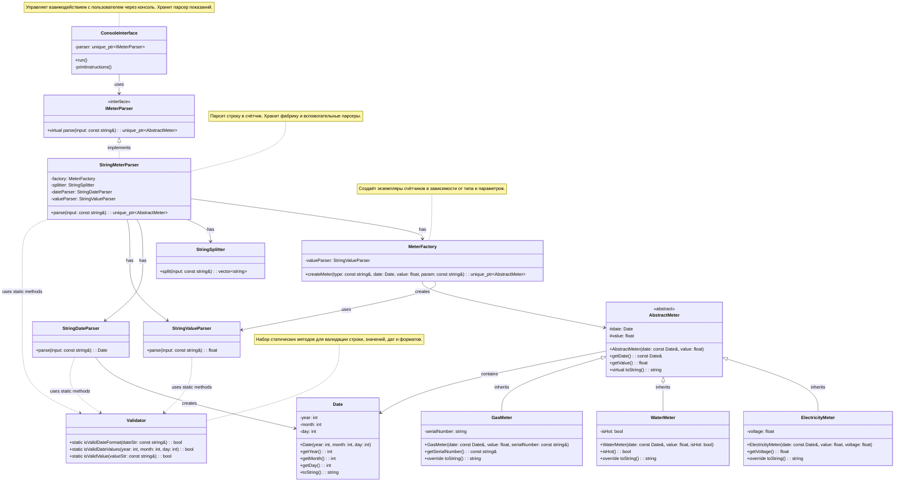

Дулисов С. Р.
### Диаграмма Классов (UML)

```mermaid
classDiagram
    %% ==== Классы ====
    class ConsoleInterface {
        +run()
        -printInstructions()
        -parser: unique_ptr~IMeterParser~
    }
    
    class AbstractMeter {
        <<abstract>>
        +AbstractMeter(date: const Date&, value: float)
        +getDate(): const Date&
        +getValue(): float
        +virtual toString(): string
        #date: Date
        #value: float
    }
    
    class ElectricityMeter {
        +ElectricityMeter(date: const Date&, value: float, voltage: float)
        +getVoltage(): float
        +override toString(): string
        -voltage: float
    }
    
    class WaterMeter {
        +WaterMeter(date: const Date&, value: float, isHot: bool)
        +isHot(): bool
        +override toString(): string
        -isHot: bool
    }
    
    class GasMeter {
        +GasMeter(date: const Date&, value: float, serialNumber: const string&)
        +getSerialNumber(): const string& 
        +override toString(): string
        -serialNumber: string
    }
    
    class Date {
        +Date(year: int, month: int, day: int)
        +getYear(): int
        +getMonth(): int
        +getDay(): int
        +toString(): string
        -year: int
        -month: int
        -day: int
    }
    
    class IMeterParser {
        <<interface>>
        +virtual parse(input: const string&): unique_ptr~AbstractMeter~
    }
    
    class StringMeterParser {
        +parse(input: const string&): unique_ptr~AbstractMeter~
        -factory: MeterFactory
        -splitter: StringSplitter
        -dateParser: StringDateParser
        -valueParser: StringValueParser
    }
    
    class MeterFactory {
        +createMeter(type: const string&, date: Date, value: float, param: const string&): unique_ptr~AbstractMeter~
        -valueParser: StringValueParser
    }
    
    class Validator {
        +static isValidDateFormat(dateStr: const string&): bool
        +static isValidDateValues(year: int, month: int, day: int): bool
        +static isValidValue(valueStr: const string&): bool
    }
    
    class StringSplitter {
        +split(input: const string&): vector~string~
    }
    
    class StringDateParser {
        +parse(input: const string&): Date
    }
    
    class StringValueParser {
        +parse(input: const string&): float
    }

    %% ==== Связи ====
    ConsoleInterface --> IMeterParser : uses

    StringMeterParser --> MeterFactory : has
    StringMeterParser --> StringSplitter : has
    StringMeterParser --> StringDateParser : has
    StringMeterParser --> StringValueParser : has

    MeterFactory --> StringValueParser : uses
    MeterFactory --> AbstractMeter : creates

    IMeterParser <|.. StringMeterParser : implements

    AbstractMeter <|-- ElectricityMeter : inherits
    AbstractMeter <|-- WaterMeter : inherits
    AbstractMeter <|-- GasMeter : inherits

    AbstractMeter --> Date : contains
    StringDateParser --> Date : creates

    StringMeterParser ..> Validator : uses static methods
    StringDateParser ..> Validator : uses static methods
    StringValueParser ..> Validator : uses static methods

    %% ==== Комментарии ====
    note for ConsoleInterface "Управляет взаимодействием с пользователем через консоль. Хранит парсер показаний."
    note for StringMeterParser "Парсит строку в счётчик. Хранит фабрику и вспомогательные парсеры."
    note for MeterFactory "Создаёт экземпляры счётчиков в зависимости от типа и параметров."
    note for Validator "Набор статических методов для валидации строки, значений, дат и форматов."
```