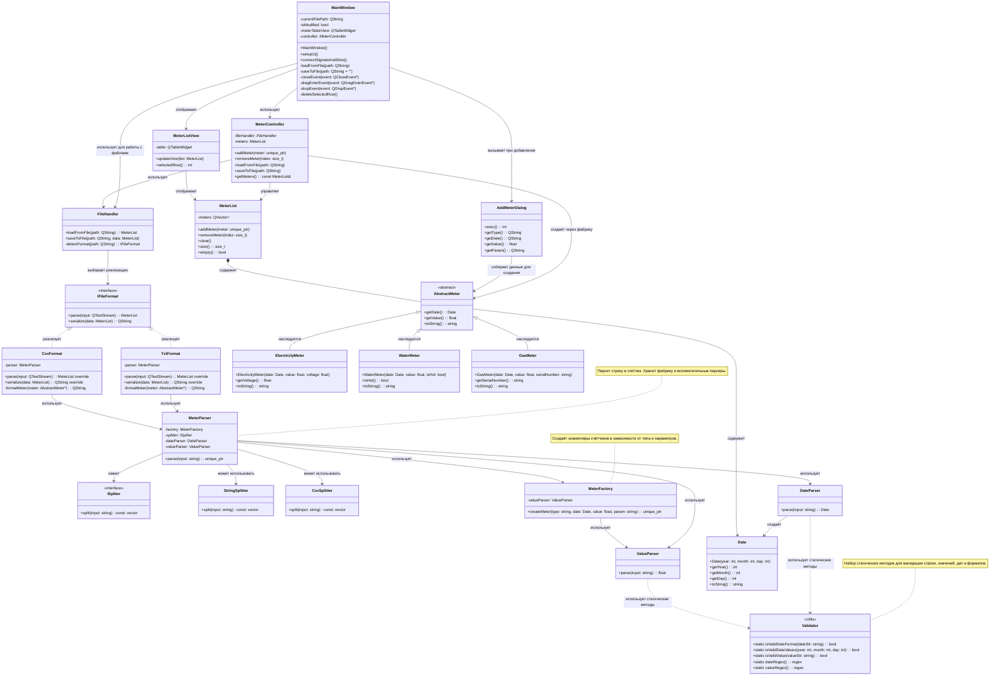

Вот обновлённая диаграмма классов, в которую я **встроил логику добавления и удаления счётчиков**, а также **работу с файлами** (перетаскивание, сохранение по умолчанию, подтверждение выхода).

---

## 🧩 Обновлённая диаграмма классов

---

## 🔄 Логика добавления и удаления счетчиков

### ✅ Добавление:
1. `MainWindow` → вызывает `AddMeterDialog`
2. `AddMeterDialog` → собирает данные
3. `MainWindow` → создаёт объект `AbstractMeter` через `MeterFactory`
4. `MainWindow` → вызывает `MeterController::addMeter()`
5. `MeterController` → добавляет счётчик в `MeterList`
6. `MeterListView` → обновляет таблицу

### ✅ Удаление:
1. `MainWindow` → получает индекс выбранной строки
2. `MainWindow` → вызывает `MeterController::removeMeter(index)`
3. `MeterController` → удаляет счётчик из `MeterList`
4. `MeterListView` → обновляет таблицу

---

## 💾 Логика работы с файлами

### ✅ Открытие файла:
1. `MainWindow` → запрашивает путь через `QFileDialog`
2. `MainWindow` → вызывает `MeterController::loadFromFile(path)`
3. `MeterController` → использует `FileHandler` для загрузки данных
4. `FileHandler` → определяет тип файла (`detectFormat`)
5. `FileHandler` → использует `IFileFormat` для чтения данных
6. `MeterList` → обновляется
7. `MeterListView` → отображает новые данные

### ✅ Сохранение файла:
1. `MainWindow` → запрашивает путь через `QFileDialog` или использует текущий путь
2. `MainWindow` → вызывает `MeterController::saveToFile(path)`
3. `MeterController` → использует `FileHandler` для сохранения
4. `FileHandler` → использует `IFileFormat` для сериализации данных

### ✅ Перетаскивание:
1. `MainWindow` → переопределяет `dragEnterEvent` и `dropEvent`
2. При перетаскивании файла → вызывается `on_loadBtn_clicked()`

### ✅ Подтверждение выхода:
1. `MainWindow` → переопределяет `closeEvent`
2. Если `isModified == true` → показывается `QMessageBox` с предложением сохранить изменения

---

## 📌 Что добавлено:

| Элемент | Назначение |
|---------|------------|
| `AddMeterDialog` | Диалог добавления нового счетчика |
| `deleteSelectedRow()` | Удаление выбранной строки из списка |
| `isModified` | Флаг изменений, влияющий на подтверждение выхода |
| `dragEnterEvent`, `dropEvent` | Поддержка перетаскивания файла |
| `QMessageBox` | Подтверждение перед выходом |

---

Если хочешь, могу:
- Показать как это выглядит в коде C++,
- Создать минимальный проект с такой же структурой,
- Сделать пример `main.cpp`.

Готов помочь!